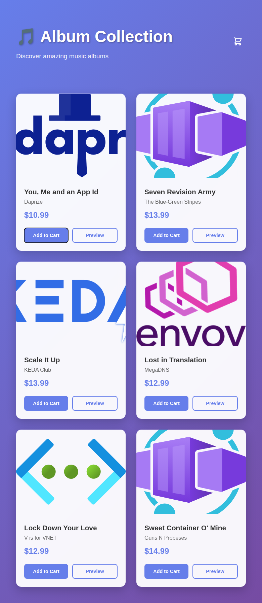
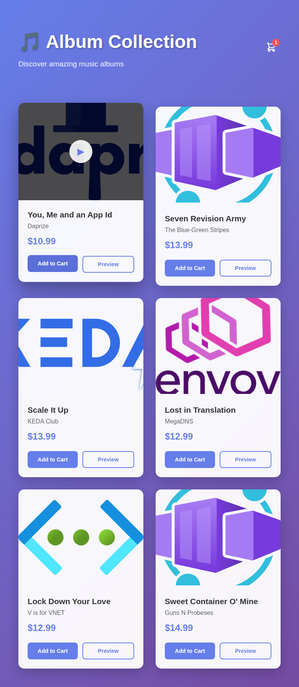
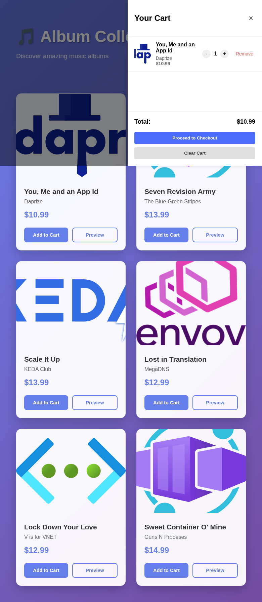

# Accessibility Review Report - Album Viewer Application

**Review Date:** September 16, 2025  
**Application:** Album Viewer (Vue.js 3 + TypeScript)  
**URL:** http://localhost:3001  
**Reviewer:** AI Accessibility Specialist  

## Executive Summary

This report presents an accessibility evaluation of the Album Viewer application, focusing on neurodiversity considerations and compliance with accessibility best practices. The application demonstrates good semantic structure and functional interactive elements, but several key accessibility issues need attention to improve the experience for users with ADHD and TSA (Autism Spectrum Disorder).

## Tested User Flows

The following core user flows were tested:

1. **Initial Application Loading** - Page load and content discovery
2. **Keyboard Navigation** - Tab order and focus management
3. **Album Browsing** - Visual scanning and interaction discovery
4. **Add to Cart Functionality** - Shopping cart interaction
5. **Cart Management** - Modal interaction and item management

## Accessibility Findings

### ✅ Positive Aspects

#### 1. Semantic HTML Structure
- **Status:** ✅ Good
- **Evidence:** Application uses proper `<header>`, `<main>` elements and correct heading hierarchy
- **Screenshot:** [02-loaded-application.png](screenshots/02-loaded-application.png)
- **Neurodiversity Impact:** Provides clear structural landmarks for screen reader users and cognitive navigation

#### 2. Descriptive Content
- **Status:** ✅ Good
- **Evidence:** Images have proper `alt` attributes, headings are descriptive
- **Benefit:** Follows "Content clarity" best practice - clear, descriptive elements facilitate navigation

#### 3. Keyboard Navigation Support
- **Status:** ✅ Functional
- **Evidence:** All interactive elements are keyboard accessible
- **Screenshots:** 
  - [03-keyboard-focus-first-button.png](screenshots/03-keyboard-focus-first-button.png)
  - [04-keyboard-focus-preview-button.png](screenshots/04-keyboard-focus-preview-button.png)
- **Neurodiversity Impact:** Supports users who prefer or require keyboard navigation

#### 4. Loading State Feedback
- **Status:** ✅ Good
- **Evidence:** Clear loading spinner with text "Loading albums..."
- **Screenshot:** [01-initial-load.png](screenshots/01-initial-load.png)
- **Neurodiversity Impact:** Reduces anxiety by providing clear feedback during wait times

### ⚠️ Issues Requiring Attention

#### 1. Missing Skip Link (HIGH PRIORITY)
- **Issue:** No "skip to main content" link for keyboard users
- **WCAG Reference:** WCAG 2.4.1 Bypass Blocks
- **Neurodiversity Impact:** 
  - **ADHD:** Increases time to reach main content, favors distraction
  - **TSA:** Forces repetitive navigation through header elements
- **Recommendation:** Add visually hidden skip link that becomes visible on focus
- **Implementation:**
  ```html
  <a href="#main" class="skip-link">Skip to main content</a>
  ```

#### 2. Play Button Accessibility Issues (HIGH PRIORITY)
- **Issue:** Play overlay button (▶) is not keyboard accessible and lacks proper labeling
- **Evidence:** Play button appears on hover but cannot be reached via keyboard
- **WCAG Reference:** WCAG 2.1.1 Keyboard, WCAG 4.1.2 Name, Role, Value
- **Neurodiversity Impact:**
  - **ADHD:** Hidden functionality creates confusion about available actions
  - **TSA:** Inconsistent interaction patterns increase cognitive load
- **Recommendation:** Make play button keyboard accessible with proper ARIA labels
- **Implementation:**
  ```html
  <button class="play-button" aria-label="Play preview for [Album Title]">▶</button>
  ```

#### 3. Focus Visibility Issues (MEDIUM PRIORITY)
- **Issue:** Default browser focus indicators may not be sufficient for all users
- **WCAG Reference:** WCAG 2.4.7 Focus Visible
- **Screenshots:** Visual evidence shows basic focus states
- **Neurodiversity Impact:**
  - **ADHD:** Weak focus indicators make navigation tracking difficult
  - **TSA:** Reduces wayfinding confidence during keyboard navigation
- **Recommendation:** Implement enhanced focus styles with better contrast
- **Implementation:**
  ```css
  .btn:focus {
    outline: 3px solid #667eea;
    outline-offset: 2px;
  }
  ```

#### 4. Modal Focus Management (HIGH PRIORITY)
- **Issue:** Cart modal lacks proper focus trap and initial focus management
- **Evidence:** Cart opens but focus management not properly handled
- **Screenshot:** [07-cart-modal-open.png](screenshots/07-cart-modal-open.png)
- **WCAG Reference:** WCAG 2.4.3 Focus Order, ARIA Authoring Practices
- **Neurodiversity Impact:**
  - **ADHD:** Focus can escape modal, causing confusion
  - **TSA:** Unexpected focus behavior disrupts mental model
- **Recommendation:** Implement focus trap and return focus to trigger element on close

#### 5. Missing Status Messages (MEDIUM PRIORITY)
- **Issue:** Actions like "Add to Cart" lack accessible status announcements
- **Evidence:** Visual feedback exists (cart counter) but no screen reader announcements
- **Screenshot:** [05-add-to-cart-success.png](screenshots/05-add-to-cart-success.png)
- **WCAG Reference:** WCAG 4.1.3 Status Messages
- **Neurodiversity Impact:**
  - **ADHD:** Silent state changes may be missed
  - **TSA:** Lack of confirmation increases anxiety about action success
- **Recommendation:** Add aria-live regions for status announcements

#### 6. Reduced Motion Considerations (LOW PRIORITY)
- **Issue:** Animations and hover effects don't respect `prefers-reduced-motion`
- **WCAG Reference:** WCAG 2.3.3 Animation from Interactions
- **Neurodiversity Impact:**
  - **TSA:** Excessive motion can be overwhelming
  - **ADHD:** Animations can be distracting
- **Recommendation:** Add media query to disable non-essential animations
- **Implementation:**
  ```css
  @media (prefers-reduced-motion: reduce) {
    .album-card {
      transition: none;
    }
  }
  ```

## Detailed Screenshots Analysis

### 1. Initial Load State

- Shows proper loading feedback
- Clear heading structure
- Good visual hierarchy

### 2. Fully Loaded Application

- Grid layout provides good organization
- Clear visual separation between albums
- Adequate color contrast on text elements

### 3. Keyboard Focus States


- Focus indicators are visible but could be enhanced
- Logical tab order follows visual layout

### 4. Interactive Success States


- Visual feedback is clear
- Modal structure is well organized
- Cart counter provides immediate visual confirmation

## Recommendations by Priority

### P1 - Critical (Implement Immediately)
1. **Add skip link** for keyboard navigation efficiency
2. **Fix play button accessibility** - make keyboard accessible
3. **Implement modal focus management** for cart overlay

### P2 - High (Implement Soon)
1. **Enhanced focus indicators** with better visibility
2. **Status message announcements** for dynamic actions
3. **Aria labels for decorative elements** like play buttons

### P3 - Medium (Plan for Next Sprint)
1. **Reduced motion support** for sensitive users
2. **Consistent heading hierarchy** verification
3. **Color contrast audit** for all text elements

## Compliance Summary

| WCAG Criterion | Status | Notes |
|----------------|--------|--------|
| 1.3.1 Info and Relationships | ✅ Pass | Good semantic structure |
| 2.1.1 Keyboard | ⚠️ Partial | Most elements accessible, play button fails |
| 2.4.1 Bypass Blocks | ❌ Fail | No skip link present |
| 2.4.3 Focus Order | ⚠️ Partial | Logical order, modal management needed |
| 2.4.7 Focus Visible | ⚠️ Partial | Basic indicators present, enhancement needed |
| 4.1.2 Name, Role, Value | ⚠️ Partial | Most elements proper, play button lacks label |
| 4.1.3 Status Messages | ❌ Fail | No accessible status announcements |

## Neurodiversity-Specific Recommendations

### For ADHD Users
1. **Reduce cognitive fatigue:** Implement clearer focus indicators
2. **Minimize distractions:** Add option to disable animations
3. **Provide immediate feedback:** Enhance status messages for all actions

### For TSA Users  
1. **Consistent structure:** Ensure all interactive elements behave predictably
2. **Clear navigation paths:** Add skip links and focus management
3. **Reduce anxiety:** Provide clear confirmation of actions

## Next Steps

1. **Immediate:** Implement P1 critical issues within current sprint
2. **Short-term:** Address P2 high priority items in next development cycle
3. **Long-term:** Establish automated accessibility testing pipeline
4. **Ongoing:** Regular accessibility audits with user testing

## Testing Methodology

This review was conducted using:
- **Playwright MCP Server** for automated interaction testing
- **Keyboard-only navigation** testing
- **Visual accessibility assessment** via screenshots
- **Code review** of Vue.js components for semantic HTML
- **WCAG 2.1 AA compliance** evaluation
- **Neurodiversity best practices** assessment per provided guidelines

---

*This report was generated using automated accessibility testing tools and manual evaluation. For comprehensive accessibility validation, consider supplementing with user testing involving individuals with disabilities.*